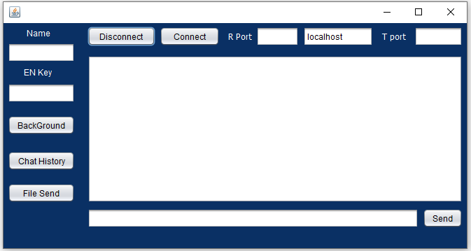

# P2P-Messaging-Java
A P2P messaging application in Java to exchange message and files between two users. Run **MyChatAppp.java** which can be found in this path
```
/src/mychatapp/MyChatApp.Java
```
A screen like below will be popped up.



1. **Name**: One must put his user name other wise the default name will be “Name”.
2. **En key**: This is the encryption key. If the keys from both sides do not match up they will not be able to read messages. En key must be ***-15 to 5*** in jar file. If
anyone runs JAVA file by directly from source code, any positive integers can be used as an encryption key. (Actually the intended encrytion algorithm Caesar Cipher but the algorithm was not implemented properly. There is a bug remaining in development process)
3. **R port**: This is the port where one will receive the incoming messages. This must be any positive integer between 1024-65535.
4. **T port**: This is the port by which one will communicate with other side. This must be any positive integer between 1024-65535.
5. **IP**: Default IP is given localhost. Anyone can change it to any valid real ip to connect.
6. **Connect Button**: After insertion of name, En Key, R port, T port and IP address one must press the Connect button in order to establish the connection with the other side.
7. **Disconnect Button**: By Clicking this button any user can disconnect from the other side. So he will not receive message neither can send message.
8. **Text Area**: The big box just below the Connect or Disconnect button is the Text area. Any exchanged message will appear here.
9. **Send Box Area**: The long space on the left side of Side button is called Send box area. Anything the user wish to send must type on this area.
10. **Send Button**: After writing the message on Send Box area user must press the Send Button to send the message to the other side .
11. **Background Button**: Pressing this key will change the color of GUI and Text area.
12. **Chat history**: Clicking this button will download the chat history between two users as a text file. It will be saved in the project folder asChatHistory.txt.
13. **File Send**: Clicking this button will tell the user to specify the file path example : C:\Users\username\Desktop\1.txt. If the file path is valid it will send the file data to the other side i.e receiver. By using this app one can send up to 20 MB size of any kind whether it is txt, mp3, mp4, pdf or another file

## How to run the app:
>If you run from jar file press twice to run the project 2 times. So you can chat with yourself. The R-port of one app will be the T-port of another app and vice versa. Input the En-key and name and press connect. Now you can chat with yourself in localhost. If two parties have valid real IP and properly port forwarded in the router the two parties can chat remotely.

___
**Explanation on Source Code**
___

## MessageListener.java

  - It acts like a server
  - Opens up socket to accept incoming connections, it never gets closed down
  - If a special signal ***.......1*** comes from sender, it accepts file, otherwise accepts text message

## MessageTransmitter.java

  - It acts like a sender
  - Opens up socket to send messages to a specific IP and Port, then closes it down.
  - It also creates a socket connection with itself, so that the text message gets bounce back to itself and the user can see what he has writte.

## MainScreen.java

  - The codes are not written manually for maximum lines
  - These are auto generated codes from Java Swing
  - After line 284, chat history saving system is introduced. Basically all messages are appended in a String and later the String is written in a text file.


